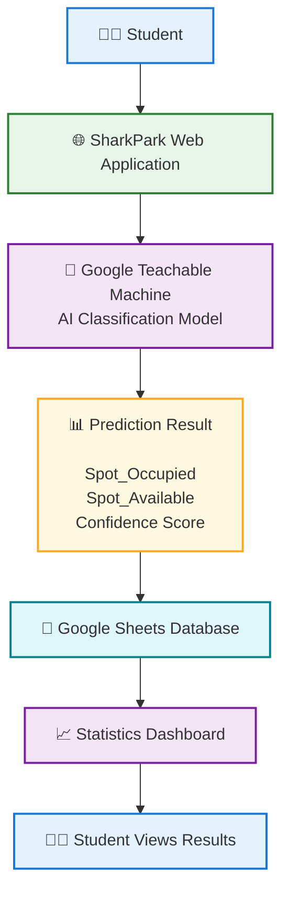
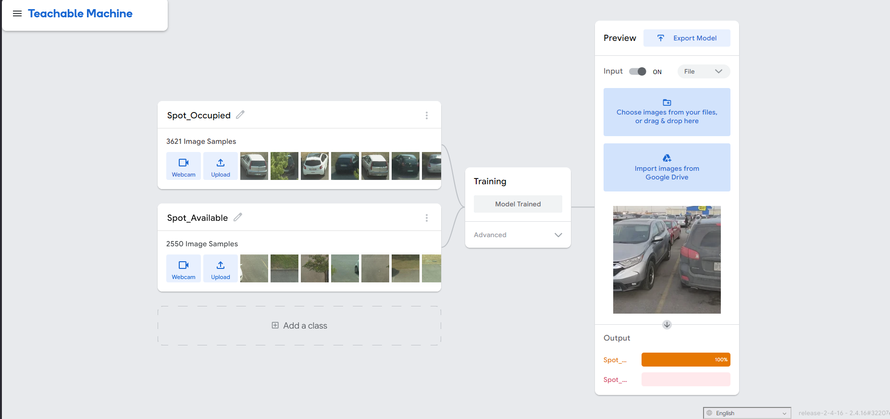
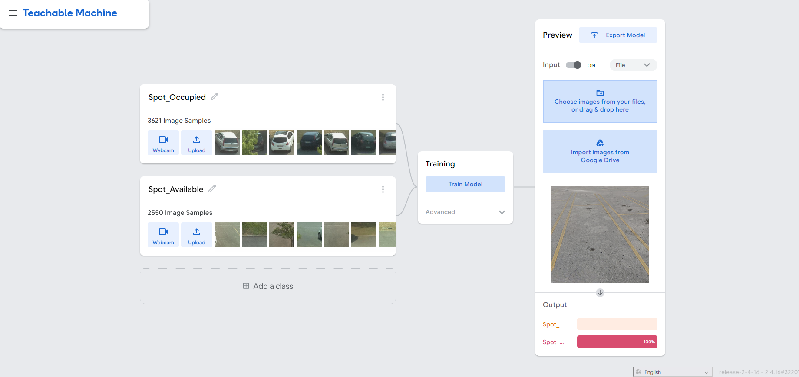

# SharkPark: MDC Homestead Smart Stall Monitor

## Project Information

### Project Title
**SharkPark: MDC Homestead Smart Stall Monitor**

### Students

**Raydel Castro** – Data Analyst & Web Developer

**Leover Perez Solis** – Project Manager & Systems Designer

**Cristian E. Barrera** – AI Project Management

**Patrick Conyers** – Quality Assurance & Testing Specialist

### Institution

**Miami Dade College - Homestead Campus**

### Project Type

**No-Code Artificial Intelligence Application**

### Target Audience

Students, faculty, and commuters arriving at Miami Dade College Homestead Campus during peak class periods, especially around **8:30 AM** and **5:30 PM**.

### No-Code Technology Stack

- Google Teachable Machine (Computer Vision Model)
- Google Sheets (Data Collection Repository)
- ChatGPT (Web Application Development)

### Total Cost

**$0.00**

The project uses free educational and public-access tools.

---

# Stage 1: Problem Scoping & Data Collection

## Problem Statement

During peak class hours at Miami Dade College Homestead Campus, students often spend several minutes driving through parking lots searching for an available parking space. This creates traffic congestion, increases fuel consumption, and causes students to arrive late to class.

SharkPark uses Artificial Intelligence and Computer Vision to identify whether parking spaces are occupied or available and displays parking availability statistics through a web application.

---

## Project Objectives

### Primary Objective

Develop an Artificial Intelligence system capable of classifying parking spaces as occupied or available.

### Secondary Objectives

- Reduce parking search time.
- Improve student punctuality.
- Demonstrate the use of Computer Vision in a real-world scenario.
- Collect parking occupancy data.
- Display parking statistics in real time.

---

# Data Collection

## Dataset Source

The SharkPark project utilized the **CNRPark+EXT Dataset**, a publicly available parking occupancy dataset used for computer vision and smart parking research.

### Dataset Website

http://cnrpark.it/

### Dataset Advantages

- Thousands of parking-space images.
- Occupied parking-space samples.
- Available parking-space samples.
- Different lighting conditions.
- Different weather conditions.
- Real-world parking scenarios.

The dataset was used to train and validate the SharkPark Artificial Intelligence model.

---

## Dataset Classes

### Spot_Occupied

**Number of Images:** 2,000+

#### Visual Characteristics

- Compact cars
- Sedans
- SUVs
- Pickup trucks
- Vehicles parked within parking lines

#### Purpose

Train the AI model to identify occupied parking spaces.

---

### Spot_Available

**Number of Images:** 2,000+

#### Visual Characteristics

- Empty asphalt
- Parking lines
- Open parking stalls
- Oil stains
- Parking spaces covered by shadows without vehicles

#### Purpose

Train the AI model to identify available parking spaces.

---

## Dataset Summary

| Category | Total Images |
|-----------|-------------|
| Spot_Occupied | 2,000+ |
| Spot_Available | 2,000+ |
| Total Dataset Size | 4,000+ |

### Benefits of a Large Dataset

The large dataset improves the model's ability to:

- Recognize different vehicle types.
- Handle varying lighting conditions.
- Reduce classification errors.
- Improve prediction confidence.
- Generalize to real-world parking environments.

---

## Dataset Limitations

The majority of images were collected during daytime conditions.

Potential limitations include:

- Nighttime parking conditions
- Heavy rainfall
- Wet pavement reflections
- Strong shadows
- Extreme camera angles

---

# Stage 2: AI Model Construction

## Platform

Google Teachable Machine

### Model Type

Standard Image Classification Model

### Architecture

MobileNet Transfer Learning

### Training Parameters

- Epochs: 50
- Batch Size: 16
- Learning Rate: 0.001

---

## Deployed Model

After training, the model was published through Google Teachable Machine and is publicly accessible at:

### Model URL

https://teachablemachine.withgoogle.com/models/-nQdOh3--/

### Classification Categories

- Spot_Occupied
- Spot_Available

---

## Iterative Improvement

### Initial Failure

During preliminary testing, empty parking spaces covered by shadows from light poles were incorrectly classified as occupied with approximately 88% confidence.

### Corrective Action

Additional images of shadow-covered empty parking spaces were added to the Spot_Available class and the model was retrained.

### Result

The retrained model successfully learned to distinguish shadows from actual vehicles, reducing false-positive classifications.

---

# Stage 3: Application Interface

## Backend Database

### Google Sheets Data Collection Repository

Google Sheets serves as the central data collection repository for SharkPark. Each time a parking-space image is analyzed by the AI model, the classification result is stored in the database.

### Database Link

https://docs.google.com/spreadsheets/d/1eggKEPsVeZjnHLcCMesufamH3mj6PnWDOq6SRob142Y/edit?gid=1415101545#gid=1415101545

### Google Sheets Structure

| Column | Description |
|----------|------------|
| Zone | Parking lot area being monitored |
| Bay_Number | Parking space identifier |
| Status | Occupied or Available |
| Confidence_Score | AI confidence percentage |
| Last_Updated | Date and time of classification |
| Image_Sample | Image associated with the classification |

### Purpose

The database is used to:

- Store parking-space classification results.
- Track the status of each parking space.
- Save AI confidence scores.
- Monitor parking availability in real time.
- Calculate total occupied and available parking spaces.
- Generate occupancy percentages for the SharkPark dashboard.

---

## Data Collection Workflow

1. A user captures an image of a parking space.
2. The AI model analyzes the image.
3. The model classifies the space as Spot_Occupied or Spot_Available.
4. A confidence score is generated.
5. The result is automatically stored in Google Sheets.
6. The application updates parking statistics in real time.

---

## Data Flow Diagram

```text
+------------------+
|     Student      |
+--------+---------+
         |
         v
+---------------------------+
| SharkPark Web Application |
+--------+------------------+
         |
         v
+---------------------------+
| Google Teachable Machine  |
| AI Classification Model   |
+--------+------------------+
         |
         v
+---------------------------+
| Prediction Result         |
| Spot_Occupied             |
| Spot_Available            |
| Confidence Score          |
+--------+------------------+
         |
         v
+---------------------------+
| Google Sheets Database    |
+--------+------------------+
         |
         v
+---------------------------+
| Statistics Dashboard      |
+--------+------------------+
         |
         v
+---------------------------+
| Student Views Results     |
+---------------------------+
```



---

# Frontend

## SharkPark Web Application

The SharkPark application is a responsive web application created with the assistance of ChatGPT and connected to the Google Sheets database.

### Web Application URL

https://rcastroguerra.github.io/CAI1001C-2267-7549-Artificial-Intelligence-AI/

### Main Features

- Upload parking-space images.
- Analyze parking-space occupancy.
- Display AI confidence scores.
- View real-time parking statistics.
- Monitor multiple parking lots.
- Responsive design for desktop and mobile devices.

---

## User Workflow

### Input

A student opens SharkPark and:

- Uploads a parking-space image.
- Uses a mobile camera to capture an image.
- Selects a parking lot.

### Processing

The AI model analyzes the image and determines whether the parking space is occupied or available.

### Output

The application automatically calculates and displays:

- Total Spaces Monitored
- Available Spaces
- Occupied Spaces
- Percentage of Available Spaces
- Percentage of Occupied Spaces
- Last Update Time

---

## Dashboard Example

### SharkPark Dashboard

- Total Spaces Monitored: 185
- Available Spaces: 67 (36%)
- Occupied Spaces: 118 (64%)
- Last Updated: 8:25 AM

### Parking Lots Monitored

- Lot 1 - North
- Lot 2 - South
- Lot 3 - East

---

## Lot Example

### Lot 1 - North

- Total Spaces: 50
- Available Spaces: 18 (36%)
- Occupied Spaces: 32 (64%)

### Lot 2 - South

- Total Spaces: 75
- Available Spaces: 27 (36%)
- Occupied Spaces: 48 (64%)

### Lot 3 - East

- Total Spaces: 60
- Available Spaces: 22 (37%)
- Occupied Spaces: 38 (63%)

The information updates automatically whenever new parking-space classifications are added to the database.

---

# Stage 4: Evaluation & Ethical Reflection

## Testing Matrix

### Test Case 1: Occupied Space

**Input Condition**

White sedan parked correctly inside a parking space.

**Expected System Action**

Classify the image as Spot_Occupied with confidence greater than 90%.

**Observed Behavior**

The model correctly classified the parking space as Spot_Occupied with 98% confidence.

**Result:** ✅ Test Passed

---

### Test Case 2: Empty Space

**Input Condition**

Empty parking stall with visible parking lines and clear asphalt.

**Expected System Action**

Classify the image as Spot_Available with confidence greater than 90%.

**Observed Behavior**

The model correctly classified the parking space as Spot_Available with 95% confidence.

**Result:** ✅ Test Passed

---

# Testing Evidence

## Occupied Space Classification

</img>

The image above shows the Teachable Machine model successfully classifying an occupied parking space.

---

## Available Space Classification

</img>

The image above shows the Teachable Machine model successfully classifying an available parking space.

---

# Bias and Fairness Analysis

## Angle and Lighting Bias

If training images are collected from only a limited number of viewpoints, the model may perform less accurately when classifying parking spaces from unfamiliar angles.

### Mitigation

Collect additional images from:

- Ground level
- Elevated viewpoints
- Different times of day
- Different weather conditions

---

## Vehicle Diversity Bias

The model may struggle to recognize uncommon vehicle types if they are underrepresented in the training dataset.

### Examples

- Motorcycles
- Large pickup trucks
- Vans
- Electric vehicles

### Mitigation

Expand the dataset to include a broader variety of vehicle types.

---

# Privacy and Safety Considerations

## Privacy by Design

The system focuses exclusively on parking-space availability.

Measures include:

- Limiting camera views to parking stalls.
- Avoiding images of driver faces.
- Excluding unnecessary personal information.
- Collecting only parking availability data.

---

## Driver Safety Disclaimer

A permanent notice appears within the application:

> "Do not operate or interact with this app while driving. Check availability before operating your vehicle."

---

# Live AI Model Demonstration

## Teachable Machine Model

https://teachablemachine.withgoogle.com/models/-nQdOh3--/

Users can upload an image or use a webcam to determine whether a parking space is occupied or available. The AI returns a confidence score and stores the result in the SharkPark database.

---

# Team Roles and Responsibilities

| Team Member | Role |
|-------------|------|
| Raydel Castro | Data Analyst & Web Developer |
| Leover Perez Solis | Project Manager & Systems Designer |
| Cristian E. Barrera | AI Project Management |
| Patrick Conyers | Quality Assurance & Testing Specialist |

---

# Expected Benefits

## For Students

- Faster parking searches.
- Improved punctuality.
- Reduced stress before class.

## For the Campus

- Reduced parking lot congestion.
- Better visibility of parking availability.
- Improved parking management.

## Environmental Benefits

- Reduced vehicle idling time.
- Lower fuel consumption.
- Reduced emissions.

---

# Future Improvements

Potential future enhancements include:

- Nighttime parking detection.
- Weather-resistant classification.
- Automatic camera integration.
- Live parking maps.
- Historical occupancy analytics.
- Expansion to additional MDC campuses.

---

# Project Deliverables

The SharkPark project successfully produced:

1. AI Computer Vision Model.
2. Trained Google Teachable Machine Classifier.
3. Google Sheets Database Repository.
4. Web Application.
5. Real-Time Parking Dashboard.
6. Parking Occupancy Reporting System.
7. Testing and Validation Results.
8. Complete Project Documentation.

---

# Conclusion

**SharkPark** is a no-code Artificial Intelligence parking monitoring system developed for Miami Dade College Homestead Campus. Using Google Teachable Machine, Google Sheets, and a web application created with ChatGPT assistance, the system automatically classifies parking spaces as occupied or available. The application stores parking data, calculates occupancy statistics, and displays real-time information for Lot 1 - North, Lot 2 - South, and Lot 3 - East. The AI model successfully classified both occupied and available parking spaces during testing, demonstrating that computer vision can be used as a practical and low-cost solution to improve the parking experience for students and campus commuters.